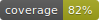

# 40K dice stats computing

This code is a Python toolset for WH40k dice statistical computation. This code works in two parts:
* A stat computing (in python): capability to compute the average enemy dead / HP lost after an attack, depending on strength, AP, ... (see `src/`)
* An interface, coded with `kivy` to enable android app. In this app, you can compute stats and compare results on typical enemy stats (marine, tank, ...)
(see [main.py](main.py))

<!-- Badges -->

[](https://www.python.org/downloads/release/python-311/)




## Table of Contents
1. [Presentation of the app]( #presentation-of-the-app)
2. [Questions](#questions)
   - [How to start](#how-to-start)
   - [How to add more profiles (datasheet) ?](#how-to-add-more-profiles-datasheet)
   - [Useful links](#Useful-links)
   - [Acronyms](#Acronyms)
3. [Elements for developers](#Elements-for-developers)
   - [How to install (developers)](#How-to-install-developers)
   - [How to commit and push (developers)](#How-to-commit-and-push)
   - [How to compute code coverage](#how-to-compute-code-coverage-developers)
   - [How to access the app](#How-to-access-the-app) 
   - [Architecture of dirs](#Architecture-of-dirs)

## Presentation of the app

The app permits to compute average dead / wounds given to typical classes of ennemy. It permits to evaluate the strenght of
an unit / weapon on a glimpse. Here are the typical enemy considered (their stats are stored in [data/enemy.csv](data/enemy.csv)):
* custom enemy
* space marine
* sorotita default soldier
* astra militarum guard
* terminator
* space marine captain in terminator armor
* monster
* heavy imperial knight


## Questions

### How to start

You may need to install python and dependencies (see [How to install (developers)](#How-to-install-developers))

Just launch `src/main.py`, on a terminal:
```
cd src
python main.py
```

### How to add more profiles (datasheet) ?

Update file [data/enemy.csv](data/enemy.csv).
"Compile" file: `python src/build_enemy.py`. This script permits to create a .py file containing content of CSV -> avoid
using heavy python library to manage the CSV (pandas, ...). A priori, it is optimal way to do.

### How to modify app icon ? 

Modify file in [data/icon.ico](data/icon.ico).

### Useful links

This code were performed thanks to [this medium tutorial](https://towardsdatascience.com/building-android-apps-with-python-part-1-603820bebde8). 

Our model is [this 40k dice stats computer](https://www.rolegenerator.com/en/module/w40k).

### Acronyms

* fnp: feel no pain
* svg: save


## Elements for developers

### How to install [developers]

You can install code on your own laptop to develop and modify the app.

1. Install Python (if you are on Windows, I advise you to install Python via [miniconda](https://docs.conda.io/projects/miniconda/en/latest/))

NB: On Linux distribution, Python is installed by default. 

2. Install tox, the environment manager: `pip install tox`

3. Run tox to init the correct environment and run tests: `tox`.

NB: The name of this environment can be modified in [tox.ini](tox.ini) file (section `[tox]  envlist=`)
NB: To recreate your tox env, just rm the `.tox` dir and re-run command `tox`.

### How to commit and push [developers]

Just call [auto_push.sh](auto_push.sh) script. If you are on windows, use `gitbash` to call the script. 

Action performed:
* Create `enemy.py` from `data/enemy.csv` > permits to avoid using pandas (heavy lib) to handle CSV
* update version (in `src.__version__` and `buildozer.spec`)
* stage, commit and push

```
# Windows gitbash terminal OR Linux terminal:
>>>source auto_push.sh
# no argument > commit message automatically generated

>>>source auto_push.sh "my commit message"
# will commit and push your custom message
```

### How to compute code coverage [developers]

1. Activate env (`tox` on a terminal)
2. `pytest -v --cov=src test/ --cov-report=term-missing --log-cli-level=DEBUG`
 * Column `Missing` point out all lines not reached during tests.


### How to access the app 

On your mobile phone, go to the github page of the project:
* go to "Actions" 
* click on the last commit (may be green: the app build succeed)
* at the bottom of the page ("Artifacts") click on download button of "package"
* Unzip and install the app (pay attention to uninstall older version)

**You may be logged to be able to download the app.**

### Architecture of dirs


* [requirements.txt](requirements.txt): all python library to install. Do not pay attention to this script, `tox` will automatically handle it
* [tox.ini](tox.ini): A simple configuration file containing all useful info (libs, python version, ...) when launching command `tox`
* dir [test](test/): contains all test scripts. Permits to test non regression of the evolution of the code.
* dir [data](data/): contains a dataset of typical enemy. 
  * [enemy.csv](data/enemy.csv): contains the stats of typical enemy
* dir `src/` contains all source code
    * [__version__](src/__version__.py): a script containing version of the app. Do not touch it, it's automatically updated with `auto_push.sh` script. 
    * [main.py](src/main.py): The main script, permitting to launch an app (via `kivy` python library)
    * sub dir `common` with all useful scripts:
      * [dice](src/common/dice.py): All useful functions permitting to compute stats on dice launch
      * [workflow](src/common/workflow.py): Simulate an attack: (1) touch and (2) wounds, then, compute saves, and eventually feel no pain
      * [utils](src/common/utils.py): set default configuration (essentially for tests and debug), e.g. critical hit on `6`...
      * [build_enemy](src/common/build_enemy.py): A script to transform `data/enemy.csv` into `src/enemy.py`
      * [enemy](src/common/enemy.py): A script containing the `enemy.csv` data defined as python dict. Permits to avoid using heavy library (pandas, csv...) and lighten the kivy dependencies.
* File [.github/workflows/build.yml](.github/workflows/buildozer.yml): contains commands to build the app on github 
plateform (launched when new code is push). See github documentation [here](https://github.com/ArtemSBulgakov/buildozer-action)
* File [buildozer.spec](buildozer.spec): File containing command to launch on github servers when code is push. Note that version is automatically filled via `auto_push.sh` script.
(see details [here](https://github.com/ArtemSBulgakov/buildozer-action/tree/master))
* Script [auto_push.sh](auto_push.sh): script permitting to update version, commit and push. One single argument: ypur commit message (else, if no argument, automatically produce a commit message)
